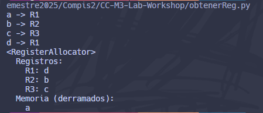

# Construcción de Compiladores — Workshop sobre Asignación de Registros y _Spilling_ con `obtenReg` (Solución)

**Integrantes:**

- Diego Pablo Valenzuela Palacios
- Gerson Alexander Ramirez Conoz
- Madeline Nahomy Castro Morales
- Aroldo Xavier López Osoy

---

## Objetivos de aprendizaje (resumen)

- Comprender cómo `obtenReg` decide la asignación de registros y cuándo realizar _spilling_.
- Detectar por qué una mala gestión de registros provoca ineficiencias.
- Aplicar los criterios en ejemplos prácticos y resolver problemas.

---

## Ejemplo 1 — Sin _spilling_

**TAC:** `x = a + b`

**Idea:** si `a` ya reside en `R1` y `b` en `R2`, se reutilizan. De lo contrario, se cargan y se suma en un tercer registro:

```asm
# Caso general (si no están cargados):
LD R1, a
LD R2, b
ADD R3, R1, R2   # x = a + b (resultado en R3)
```

**Conclusión:** no se requiere _spilling_ porque hay registros suficientes y se prioriza la reutilización.

---

## Ejemplo 2 — Cuando no hay registros libres

**TAC:** `t = a - b` (con todos los registros ocupados)

**Estrategia de `obtenReg`:**

1. **Reutilización antes que _spilling_**

   - Si el valor ya está **también** en memoria (_clean_), se puede reutilizar su registro.
   - Si el valor **no se usará más adelante** (según análisis de vida útil), se reutiliza.
   - Si el valor **se puede recalcular** a bajo costo, se puede descartar y recomputar cuando sea necesario.

2. **Si nada de lo anterior aplica → _spilling_**  
   Elegir un candidato (p. ej., una temporal) y **guardar a memoria** para liberar un registro:

   ```asm
   ST t, R3        # Derrama el valor de R3 a memoria (t := R3)
   ```

3. **Realizar la operación con el registro liberado**
   ```asm
   SUB R3, R1, R2  # t = a - b, resultado en R3
   ```

---

# **Actividad — ¿Cómo decidir el Paso 1 de forma programática?**

Una implementación razonable en `obtenReg` puede seguir esta **política por prioridad**:

1. **Si la variable ya está en un registro**, devolverlo (0 costo).
2. **Si hay un registro libre**, asignarlo.
3. **Si no hay registros libres**, seleccionar víctima según estas heurísticas (en orden):
   - **No vivo / sin usos futuros**: elegir un registro cuyo valor **no aparezca** en usos futuros.
   - **En memoria y _clean_**: su valor ya está sincronizado en memoria (no requiere `ST`).
   - **Recomputable barato**: constantes, instrucciones triviales (ej.: `a+1`) o expresiones etiquetadas como “baratas”.
   - **Lejano próximo uso (Belady-like)**: si existe información de **próximo uso**, preferir el que **tarde más** en volver a usarse.
   - **LRU** como _fallback_ local: si no hay información de próximo uso, elegir el **menos recientemente usado**.
4. **Si la víctima está _dirty_** (no sincronizada) **y seguirá viva**, emitir `ST` antes de reasignar.
5. Asignar el registro liberado a la nueva variable y actualizar metadatos (vivos, próximo uso, _dirty_).

---

## Ejemplo 3 — _Spilling_ innecesario y mejora

**TAC original:**

```
t = a - b
u = a - c
v = t + u
a = d
d = v + u
```

# **Análisis del error**

- En el flujo defectuoso, se reservó `R3` para `t` y se forzó un _spilling_ temprano.
- Consecuencia: escrituras/lecturas a memoria evitables y más instrucciones.

# **Reescritura eficiente sin _spilling_ (solo 3 registros: R1–R3)**

**Idea clave:** **sobre-escribir** registros cuyos valores **no** se usarán más adelante y mantener en registros los valores con vida útil **más larga**.

```asm
# t = a - b
LD  R1, a           # R1 = a
LD  R2, b           # R2 = b
SUB R2, R1, R2      # R2 = t (= a - b)  ; b no se usa más → sobrescribir R2

# u = a - c
LD  R3, c           # R3 = c
SUB R1, R1, R3      # R1 = u (= a - c)  ; c no se usa más → R3 libre lógico tras el uso

# v = t + u
ADD R3, R2, R1      # R3 = v (= t + u)  ; R2=t, R1=u, R3=v

# a = d
LD  R2, d           # Reutiliza R2 para d (t ya no se usa)
ST  a, R2           # a := d

# d = v + u
ADD R2, R3, R1      # R2 = d (= v + u)
ST  d, R2           # d := R2
```

**Propiedad:** no se derraman temporales (`t`, `u`, `v`) a memoria; solo se hacen las asignaciones finales requeridas a `a` y `d`.

---

## Generación de Código Máquina (continuación con 3 registros)

**Java de entrada:**

```java
int a = 4;
int b = 8;
int c = a + b;
int d = c - a;
int e = d + b;
int f = e + c;
int g = f - d;
int h = g + e;
```

**Inicio dado:**

```asm
LDI R1, 4          # a = 4
LDI R2, 8          # b = 8
ADD R3, R1, R2     # c = a + b
SUB R1, R3, R1     # d = c - a
# En este punto: R1=d, R2=b, R3=c
```

# **Continuación (sin _spilling_, solo R1–R3):**

```asm
# e = d + b
ADD R2, R1, R2     # R2 = e ; b no se usa más

# f = e + c
ADD R3, R2, R3     # R3 = f ; c no se usa más

# g = f - d
SUB R3, R3, R1     # R3 = g ; f no se usa más

# h = g + e
ADD R1, R3, R2     # R1 = h ; resultado final en R1
```

**Mapa de registros final:** `R1=h`, `R2=e`, `R3=g`.  
**Observación:** se preservan en registros las variables con vida útil más larga y se sobre-escriben los valores muertos.

---

## Implementación en Python — Esqueleto funcional de `obtenReg`

A continuación, se muestra una **implementación simple** de un asignador con 3 registros (`R1`, `R2`, `R3`) que:

- Reutiliza si la variable ya está asignada.
- Asigna un registro libre si existe.
- Si no hay libres, realiza _spilling_ con una política **FIFO** (sirve para el caso de prueba pedido).

```python
class RegisterAllocator:
    def __init__(self):
        # Registros disponibles y mapeos
        self.registers = ["R1", "R2", "R3"]
        self.reg_to_var = {r: None for r in self.registers}
        self.var_to_reg = {}
        # "Memoria" simbólica donde caen los derrames
        self.memory = set()
        # Orden de asignación (para política FIFO)
        self.allocation_order = []

    def _find_free_register(self):
        for r in self.registers:
            if self.reg_to_var[r] is None:
                return r
        return None

    def get_register(self, variable: str) -> str:
        # Si ya está asignada, devolver el registro actual
        if variable in self.var_to_reg:
            return self.var_to_reg[variable]

        # Buscar registro libre
        free = self._find_free_register()
        if free is not None:
            # Asignar variable al registro libre
            self.reg_to_var[free] = variable
            self.var_to_reg[variable] = free
            self.allocation_order.append(variable)
            return free

        # No hay libres: derramar y asignar
        return self.spill_and_assign(variable)

    def spill_and_assign(self, variable: str) -> str:
        # Política FIFO: derramar la variable más antigua
        victim_var = self.allocation_order.pop(0)
        victim_reg = self.var_to_reg[victim_var]

        # "Guardar" a memoria simbólica
        self.memory.add(victim_var)

        # Liberar estructuras de mapeo
        del self.var_to_reg[victim_var]
        self.reg_to_var[victim_reg] = None

        # Asignar la nueva variable al registro liberado
        self.reg_to_var[victim_reg] = variable
        self.var_to_reg[variable] = victim_reg
        self.allocation_order.append(variable)
        return victim_reg

    def __str__(self) -> str:
        lines = ["<RegisterAllocator>"]
        lines.append("  Registros:")
        for r in self.registers:
            lines.append(f"    {r}: {self.reg_to_var[r]}")
        lines.append("  Memoria (derramados):")
        mem_list = ", ".join(sorted(self.memory)) if self.memory else "—"
        lines.append(f"    {mem_list}")
        return "\n".join(lines)


# Casos de prueba solicitados
if __name__ == '__main__':
    allocator = RegisterAllocator()
    print('a ->', allocator.get_register('a'))  # Esperado: R1
    print('b ->', allocator.get_register('b'))  # Esperado: R2
    print('c ->', allocator.get_register('c'))  # Esperado: R3
    print('d ->', allocator.get_register('d'))  # Esperado: derrama 'a' y asigna R1
    print(allocator)
```

**Salida:**



---

# **Análisis de Vida Útil (_Liveness Analysis_)**

- **Qué es:** técnica de análisis de flujo de datos que determina, para cada punto del programa, qué variables están **vivas** (su valor **será usado** más adelante).
- **Cómo ayuda:** permite
  - construir **rangos de vida** por variable;
  - derivar un **grafo de interferencia** (aristas entre variables vivas al mismo tiempo);
  - aplicar **coloración de grafos** para asignar registros (cada color = un registro);
  - decidir **qué valores derramar** cuando el número de variables vivas excede el número de registros (heurísticas: costo de recomputar, frecuencia de uso, proximidad del próximo uso).
- **Beneficio:** reduce _spilling_ y movimientos innecesarios, maximizando reutilización y manteniendo en registros las variables más “caras” o con próximos usos más cercanos.
